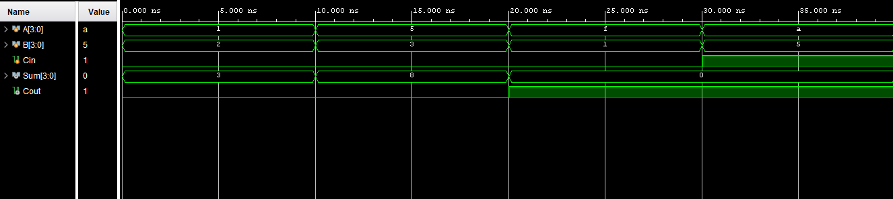

# 4-bit Ripple Carry Adder using Verilog

This project implements a 4-bit Ripple Carry Adder (RCA) using Verilog HDL. The design is built by connecting four 1-bit Full Adders in series, where the carry output of one stage becomes the carry input of the next stage.

The design was simulated and verified using Xilinx Vivado.

---

## Theory

A Ripple Carry Adder performs binary addition of two multi-bit numbers.

The carry generated by each Full Adder propagates (ripples) to the next stage.

### Block Diagram

```text
A0,B0,Cin → FA0 → C1
A1,B1,C1  → FA1 → C2
A2,B2,C2  → FA2 → C3
A3,B3,C3  → FA3 → Cout
```

---


## Project Files

| File | Description |
|--------|------------|
| fa.v | 1-bit Full Adder |
| rca.v | 4-bit Ripple Carry Adder |
| rca_tb.v | Testbench |
| waveform.png | Simulation waveform |

---

## Full Adder Module

```verilog
module fa(
    input A,
    input B,
    input Cin,
    output Sum,
    output Cout
);

assign Sum = A ^ B ^ Cin;
assign Cout = (A & B) | (B & Cin) | (A & Cin);

endmodule
```

---

## Ripple Carry Adder Module

```verilog
module rca(
    input [3:0] A,
    input [3:0] B,
    input Cin,
    output [3:0] Sum,
    output Cout
);

wire C1, C2, C3;

fa FA0(A[0], B[0], Cin, Sum[0], C1);
fa FA1(A[1], B[1], C1, Sum[1], C2);
fa FA2(A[2], B[2], C2, Sum[2], C3);
fa FA3(A[3], B[3], C3, Sum[3], Cout);

endmodule
```

---

## Testbench

```verilog
`timescale 1ns / 1ps

module rca_tb;

reg [3:0] A;
reg [3:0] B;
reg Cin;

wire [3:0] Sum;
wire Cout;

rca uut(
    .A(A),
    .B(B),
    .Cin(Cin),
    .Sum(Sum),
    .Cout(Cout)
);

initial begin

    A = 4'b0001; B = 4'b0010; Cin = 0; #10;
    A = 4'b0101; B = 4'b0011; Cin = 0; #10;
    A = 4'b1111; B = 4'b0001; Cin = 0; #10;
    A = 4'b1010; B = 4'b0101; Cin = 1; #10;

    $finish;

end

endmodule
```

---

## Simulation Waveform



---

## Output Verification

### Test Case 1

```text
A   = 0001 (1)
B   = 0010 (2)
Cin = 0
```

Result:

```text
Sum  = 0011 (3)
Cout = 0
```

---

### Test Case 2

```text
A   = 0101 (5)
B   = 0011 (3)
Cin = 0
```

Result:

```text
Sum  = 1000 (8)
Cout = 0
```

---

### Test Case 3

```text
A   = 1111 (15)
B   = 0001 (1)
Cin = 0
```

Calculation:

```text
15 + 1 = 16
```

Binary:

```text
1111 + 0001 = 10000
```

Result:

```text
Sum  = 0000
Cout = 1
```

---

### Test Case 4

```text
A   = 1010 (10)
B   = 0101 (5)
Cin = 1
```

Calculation:

```text
10 + 5 + 1 = 16
```

Binary:

```text
1010 + 0101 + 1 = 10000
```

Result:

```text
Sum  = 0000
Cout = 1
```

---

## Conclusion

The simulation results verify the correct operation of the 4-bit Ripple Carry Adder. The design successfully performs binary addition and correctly propagates carry between stages, including overflow conditions where the result exceeds 4 bits.

---

## Author

N S Farhana 
